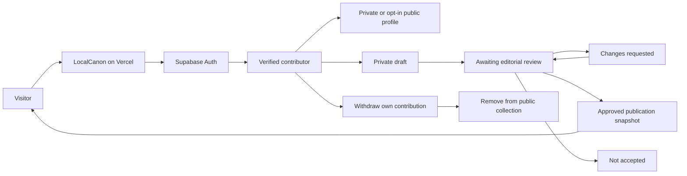

# Contributor accounts and editorial review

## Implementation

The existing magazine interface remains plain JavaScript. Vite bundles the Supabase SDK. Supabase Auth handles registration, email confirmation, sign-in, sign-out and password recovery. PostgreSQL stores profiles, private contributions, approved publication snapshots and an editorial audit trail.

The browser uses only a publishable key. Database row policies and narrowly scoped functions enforce permissions independently of the interface. Editor membership lives in the unexposed `private` schema; signup metadata cannot grant a role.



## Setup walkthrough

1. Create a Supabase project with Data API enabled and automatic table exposure disabled. Keep `private` outside the exposed schemas.
2. Run `supabase/migrations/202610010001_community.sql` once in the SQL Editor. It runs transactionally.
3. Configure Auth: email confirmation enabled, minimum password length 12, site URL set to the production LocalCanon URL. Add that URL and the local development origin as allowed redirects. Configure a production email provider; the default mail service can restrict recipients and throughput.
4. Copy the project URL and **publishable** key to `.env.local` using `.env.example`. Never use a secret or service-role key in a `VITE_` variable.
5. Install dependencies with `npm ci`; run `npm run dev`. Run `npm run check`, `npm test`, and `npm run build` before release.
6. Deploy the `dist` output to Vercel using the same two public environment variables. GitHub remains the source repository.
7. Register the editor through the normal account flow and confirm their email. Assign editor membership from SQL Editor using the verified account ID:

```sql
insert into private.editors(user_id)
values ('REPLACE_WITH_VERIFIED_AUTH_USER_UUID')
on conflict do nothing;
```

The app never offers a role switch. The review queue is at `#review`. An editor cannot approve their own contribution; another editor must review it.

## Assumptions

- The first contribution types are stories, corrections and suggestions. Corrections are published as attributed notes; they do not silently replace the original seed collection.
- Text is plain text, with safe external source links. Media is a reference link with creator and rights metadata, not an uploaded file or embed.
- A profile is private unless the contributor explicitly makes it public. Approved work always carries the agreed display-name credit.
- Review feedback stays private. A publication contains a snapshot of the submitted content and credit rather than unpublished review notes.
- Contributor lists show the most recent 100 records; review queues show the oldest 100 pending records; public selections show the latest 50 publications. Pagination is a future improvement if those limits become relevant.

## Threat and risk notes

- Ownership and editorial rights are enforced in the database. Direct writes to contribution/publication tables are denied to browser roles.
- Submission requires a verified email, publication consent, a display name and a source for documented claims. First-hand accounts remain labelled.
- Creation is limited to ten drafts per contributor per hour and five pending submissions. Profile-row locking prevents parallel requests from bypassing those limits. Auth also has provider limits; configure CAPTCHA if public abuse emerges.
- Community text is escaped before rendering. Links accept only http/https without embedded login information. Media is never fetched by a server or embedded automatically.
- Sign-in sessions use the Supabase SDK's browser storage. Protect against script injection, keep dependencies current, and sign out on shared computers. The Vercel deployment includes a restrictive Content Security Policy.
- No production test accounts or fabricated contributions should remain in the archive. Permission-test fixtures are confined to the test database.
- Withdrawal removes the public snapshot but retains private history. Account removal currently requires the operator; document and fulfil requests at the published contact address.

## Validation checklist

- [ ] Email signup, confirmation, resend, recovery and sign-out work with the configured email provider.
- [ ] Contributors can update their own profile; another user cannot.
- [ ] Private profiles stay private and public visibility can be revoked.
- [ ] Drafts and pending content cannot be read anonymously or by another contributor.
- [ ] Contributors cannot grant editor access or bypass review.
- [ ] An editor can request changes, decline or publish another contributor's work.
- [ ] Approved content carries credit, geographic scope, evidence type and sources.
- [ ] Withdrawal removes approved content from public queries.
- [ ] Mobile forms, keyboard focus, error states and session expiry are checked.

`tests/database.test.mjs` executes the migration in PGlite PostgreSQL and tests permissions as anonymous, contributor, unrelated contributor, unconfirmed contributor and editor roles. This checks the actual SQL rules, rather than a mock permission implementation. Provider email delivery and production Auth remain separate live checks.
